# تصميم وتنفيذ شبكة جامعة متعددة الكليات والمباني

## ملخص تنفيذي وحالة التسليم

تصميم شبكة جامعة من خمسة مبانٍ وأربع كليات، مع مركز بيانات مستقل وإدارة شبكية محمية. تم إعداد التصميم والعنونة والإعدادات من نموذج بيانات موحد. أعداد الأجهزة افتراضات تصميمية وليست أرقامًا واردة في التكليف. لا تُعد الفحوص البرمجية بديلًا عن تشغيل المحاكي.

حالة الأدلة عند توليد هذا التقرير: نجح 7518 فحصًا ساكنًا وفشل 0. ملف university.pkt مبني ومحفوظ بالمحاكي؛ سجل الاختبارات التشغيلية يتضمن 3 اختبارات ناجحة موثقة. الاختبارات غير المنفذة موضحة بصراحة ولا تعد ناجحة ضمنيًا. المرجع التفصيلي tests/runtime_results.json.

## الفصل الأول: تحليل الشبكة

المصدر المرجعي هو project.pdf، التكليف النهائي العملي لمقرر تحليل وتصميم الشبكات، 14 صفحة. يُعتمد عنوان كل متطلب بدل الترقيم غير المتسلسل في المستند. لم يحدد الملف برنامج المحاكاة ولا أعداد المستخدمين ولا ميزانية الأجهزة.

| المبنى | الجهة | كتلة العناوين | نقاط النهاية المفترضة |
|---|---|---|---|
| A | Computer and IT | 10.10.0.0/16 | 704 |
| B | Engineering | 10.20.0.0/16 | 580 |
| C | Science | 10.30.0.0/16 | 512 |
| D | Business and Economics | 10.40.0.0/16 | 500 |
| E | Administration and Data Center | 10.50.0.0/16 | 334 |

الأقسام: A الأمن السيبراني والشبكات والبرمجيات والمختبرات والإدارة؛ B المدنية والكهربائية والمعامل والإدارة؛ C الفيزياء والكيمياء والمختبرات والإدارة؛ D إدارة الأعمال والمحاسبة والاقتصاد والإدارة؛ E إدارة الجامعة وشؤون الطلاب والموارد البشرية والمالية ومركز البيانات وإدارة الشبكة.

الأعداد تمثل نقاط اتصال متزامنة: حواسيب مستخدمين وأجهزة مختبرات وضيوف وهواتف وكاميرات وخوادم وأجهزة إدارة؛ لا تمثل عدد أشخاص فريدًا لأن الشخص قد يستخدم أكثر من جهاز. يضاف نمو 25% و15 عنوانًا محجوزًا لكل شبكة. الهواتف هنا شبكة بيانات مخصصة؛ إعداد المكالمات وCME ليس من متطلبات الملف ولا يُدّعى تنفيذه.

المتطلبات الوظيفية: DHCP، DNS وخدمة ويب تعليمية، OSPF، HSRP، ACL، SSH، VLAN 99 للإدارة، شبكة خوادم مستقلة، Port Security وDHCP Snooping. المتطلبات غير الوظيفية: تقليل نطاقات البث، عزل الأعطال، سهولة التوسع، وضوح التوثيق وقابلية إعادة توليد الإعدادات.

## الفصل الثاني: تصميم الشبكة

طبقة Core تتكون من زوج 3650. طبقة Distribution تضم زوج راوترات 2911 لكل مبنى، مسؤولًا عن التوجيه عبر واجهات فرعية 802.1Q وHSRP وACLs. لكل راوتر وصلة موجهة /30 إلى كل Core ووصلة Trunk إلى سويتش الوصول المحلي. يرتبط زوج سويتشات 2960 داخل المبنى بوصلة Trunk لتبادل VLANs والوصول للبوابة الاحتياطية. لا تمتد Layer 2 بين المباني.

سبب اختيار راوترات التوزيع: أظهر الفحص داخل Packet Tracer 9 فقد ارتباط ACL بواجهات SVI على سويتشات Layer 3 بعد الحفظ، بينما احتفظت واجهات 2911 الفرعية بقواعد ip access-group. تم اعتماد الحل الذي يحافظ على العزل بعد إعادة الفتح بدل الاعتماد على إعدادات نصية لا ينفذها المحاكي. هذا اختيار للمختبر؛ قد يكون زوج سويتشات Layer 3 الحقيقية أعلى أداء في الإنتاج.

التصميم الفيزيائي المقترح: Core في غرفة مركز البيانات بالمبنى E، والتوزيع في غرفة اتصالات كل مبنى، والوصول في خزائن الطوابق. الربط البعيد المقترح بالألياف وفق المسافة وميزانية البصريات، وربط الأجهزة النهائية بالنحاس ضمن حدود المسافة المناسبة. المحاكاة التعليمية تمثل الوظائف ولا تثبت سعة الألياف أو الأداء الواقعي.

عدد سويتشات Access في ملف المحاكاة لا يكفي لتوصيل جميع أعداد التخطيط الفعلية؛ الأجهزة الطرفية عينات تمثيلية. لتقدير الحجم الفعلي يُحسب عدد منافذ الوصول من مجموع نقاط النهاية بعد النمو، مع مراعاة المنافذ المحجوزة ومتطلبات PoE. الجدول أدناه حد أدنى تقريبي لسويتشات 24 منفذًا بافتراض منفذ مستقل لكل نقطة نهاية، وليس قائمة شراء نهائية.

| المبنى | نقاط النهاية بعد النمو | حد أدنى لسويتشات 24 منفذًا | الممثل في المحاكاة |
|---|---|---|---|
| A | 880 | 37 | 2 |
| B | 725 | 31 | 2 |
| C | 641 | 27 | 2 |
| D | 625 | 27 | 2 |
| E | 418 | 18 | 2 |

قرار VLAN IDs: تُستخدم أرقام متسقة للأدوار العامة مثل 10 و20 و60 و99، مع أرقام إضافية لعزل الأقسام 31 و32 والجهات الحساسة 11 و12 و13. VLAN 30 تشير إلى أول شبكة طلاب بالقسم المحدد في اسمها؛ أسماء VLANs وعناوين الشبكات تزيل الالتباس. تكرار الرقم لا يدمج نطاقات البث ما دام الربط بين المباني Layer 3.

| معيار المقارنة | تبرير القرار |
|---|---|
| الأمان | العزل ينتج من حدود Layer 3 والسياسة، وليس اختلاف الرقم وحده. |
| التوسع | يمكن إضافة قسم وشبكة داخل كتلة المبنى دون مد Layer 2 إلى Core. |
| الإدارة | توحيد أرقام الأدوار المتكررة يقلل الأخطاء؛ اسم المبنى والقسم إلزامي في الجداول. |
| Broadcast Domains | لكل مبنى وشبكة نطاق بث مستقل، حتى عند تكرار VLAN ID. |
| استكشاف الأعطال | تحديد المبنى ثم VLAN ثم Subnet يقصر نطاق التشخيص. |

VLAN 50 موجودة في E فقط للخدمات المركزية. VLAN 99 محلية لكل مبنى، مع جهاز IT معتمد في E. VLAN 998 Native غير مستخدمة للأجهزة، وVLAN 999 للمنافذ المغلقة ولا تملك واجهة Layer 3 الفرعية. شبكات الأقسام موضحة كاملة في جدول VLAN Matrix في ملف Excel.

DIST-X1 أولوية HSRP 110 وDIST-X2 أولوية 100. على سويتشات الوصول: ACC-X1 أولوية STP 4096 وACC-X2 أولوية 8192 مع Rapid-PVST. الراوتر لا يشارك في STP. لا يوجد PortFast أو BPDU Guard على رابطَي Trunk. تعطل راوتر البوابة يمكن تجاوزه عبر وصلة الوصول البينية، لكن تعطل سويتش الوصول يفصل الأجهزة الموصولة به؛ هذا حد معلن للنموذج.

## الفصل الثالث: خطة العنونة وVLSM

لكل شبكة، المطلوب = سقف(عدد الأجهزة × 1.25) + 15 عنوانًا محجوزًا. يُختار أصغر حجم كتلة يحقق 2^h - 2 ≥ المطلوب، ثم القناع /(32-h). تُرتب الشبكات من الأكبر إلى الأصغر داخل /16 الخاص بالمبنى. هذا يحقق VLSM دون تداخل.

العنوان الأول هو بوابة HSRP الافتراضية، والثاني لـDIST-X1، والثالث لـDIST-X2. العناوين من +1 إلى +15 محجوزة. يبدأ DHCP من +16 إلى آخر عنوان مضيف. شبكات الإدارة والخوادم والكاميرات بعناوين ثابتة؛ الباقي يستخدم DHCP.

| المبنى/VLAN | الأجهزة | بعد النمو | الشبكة | السعة القابلة للاستخدام | سعة الأجهزة بعد الحجز |
|---|---|---|---|---|---|
| A/10 | 24 | 30 | 10.10.5.128/26 | 62 | 47 |
| A/20 | 48 | 60 | 10.10.4.0/25 | 126 | 111 |
| A/30 | 120 | 150 | 10.10.0.0/24 | 254 | 239 |
| A/31 | 100 | 125 | 10.10.1.0/24 | 254 | 239 |
| A/32 | 140 | 175 | 10.10.2.0/24 | 254 | 239 |
| A/40 | 100 | 125 | 10.10.3.0/24 | 254 | 239 |
| A/60 | 80 | 100 | 10.10.4.128/25 | 126 | 111 |
| A/70 | 60 | 75 | 10.10.5.0/25 | 126 | 111 |
| A/80 | 16 | 20 | 10.10.5.192/26 | 62 | 47 |
| A/99 | 16 | 20 | 10.10.6.0/26 | 62 | 47 |
| B/10 | 20 | 25 | 10.20.4.0/26 | 62 | 47 |
| B/20 | 40 | 50 | 10.20.2.0/25 | 126 | 111 |
| B/30 | 140 | 175 | 10.20.0.0/24 | 254 | 239 |
| B/31 | 160 | 200 | 10.20.1.0/24 | 254 | 239 |
| B/40 | 80 | 100 | 10.20.2.128/25 | 126 | 111 |
| B/60 | 60 | 75 | 10.20.3.0/25 | 126 | 111 |
| B/70 | 48 | 60 | 10.20.3.128/25 | 126 | 111 |
| B/80 | 16 | 20 | 10.20.4.64/26 | 62 | 47 |
| B/99 | 16 | 20 | 10.20.4.128/26 | 62 | 47 |
| C/10 | 20 | 25 | 10.30.3.128/26 | 62 | 47 |
| C/20 | 36 | 45 | 10.30.3.192/26 | 62 | 47 |
| C/30 | 110 | 138 | 10.30.0.0/24 | 254 | 239 |
| C/31 | 130 | 163 | 10.30.1.0/24 | 254 | 239 |
| C/40 | 80 | 100 | 10.30.2.0/25 | 126 | 111 |
| C/60 | 60 | 75 | 10.30.2.128/25 | 126 | 111 |
| C/70 | 44 | 55 | 10.30.3.0/25 | 126 | 111 |
| C/80 | 16 | 20 | 10.30.4.0/26 | 62 | 47 |
| C/99 | 16 | 20 | 10.30.4.64/26 | 62 | 47 |
| D/10 | 24 | 30 | 10.40.4.0/26 | 62 | 47 |
| D/20 | 40 | 50 | 10.40.2.0/25 | 126 | 111 |
| D/30 | 120 | 150 | 10.40.0.0/24 | 254 | 239 |
| D/31 | 100 | 125 | 10.40.1.0/24 | 254 | 239 |
| D/32 | 80 | 100 | 10.40.2.128/25 | 126 | 111 |
| D/60 | 60 | 75 | 10.40.3.0/25 | 126 | 111 |
| D/70 | 48 | 60 | 10.40.3.128/25 | 126 | 111 |
| D/80 | 12 | 15 | 10.40.4.128/27 | 30 | 15 |
| D/99 | 16 | 20 | 10.40.4.64/26 | 62 | 47 |
| E/10 | 40 | 50 | 10.50.0.0/25 | 126 | 111 |
| E/11 | 60 | 75 | 10.50.0.128/25 | 126 | 111 |
| E/12 | 28 | 35 | 10.50.2.0/26 | 62 | 47 |
| E/13 | 28 | 35 | 10.50.2.64/26 | 62 | 47 |
| E/50 | 24 | 30 | 10.50.2.128/26 | 62 | 47 |
| E/60 | 40 | 50 | 10.50.1.0/25 | 126 | 111 |
| E/70 | 70 | 88 | 10.50.1.128/25 | 126 | 111 |
| E/80 | 20 | 25 | 10.50.2.192/26 | 62 | 47 |
| E/99 | 24 | 30 | 10.50.3.0/26 | 62 | 47 |

جدول الحدود التالي يكمل عناصر التكليف: أول وآخر مضيف، Broadcast، والقناع. البوابة الافتراضية تساوي أول مضيف في كل صف. جميع حقول التفاصيل، بما فيها عناوين جهازي HSRP ومدى DHCP، موجودة أيضًا في addressing_plan.xlsx وCSV.

| المبنى/VLAN | القناع | أول مضيف / Gateway | آخر مضيف | Broadcast |
|---|---|---|---|---|
| A/10 | 255.255.255.192 | 10.10.5.129 | 10.10.5.190 | 10.10.5.191 |
| A/20 | 255.255.255.128 | 10.10.4.1 | 10.10.4.126 | 10.10.4.127 |
| A/30 | 255.255.255.0 | 10.10.0.1 | 10.10.0.254 | 10.10.0.255 |
| A/31 | 255.255.255.0 | 10.10.1.1 | 10.10.1.254 | 10.10.1.255 |
| A/32 | 255.255.255.0 | 10.10.2.1 | 10.10.2.254 | 10.10.2.255 |
| A/40 | 255.255.255.0 | 10.10.3.1 | 10.10.3.254 | 10.10.3.255 |
| A/60 | 255.255.255.128 | 10.10.4.129 | 10.10.4.254 | 10.10.4.255 |
| A/70 | 255.255.255.128 | 10.10.5.1 | 10.10.5.126 | 10.10.5.127 |
| A/80 | 255.255.255.192 | 10.10.5.193 | 10.10.5.254 | 10.10.5.255 |
| A/99 | 255.255.255.192 | 10.10.6.1 | 10.10.6.62 | 10.10.6.63 |
| B/10 | 255.255.255.192 | 10.20.4.1 | 10.20.4.62 | 10.20.4.63 |
| B/20 | 255.255.255.128 | 10.20.2.1 | 10.20.2.126 | 10.20.2.127 |
| B/30 | 255.255.255.0 | 10.20.0.1 | 10.20.0.254 | 10.20.0.255 |
| B/31 | 255.255.255.0 | 10.20.1.1 | 10.20.1.254 | 10.20.1.255 |
| B/40 | 255.255.255.128 | 10.20.2.129 | 10.20.2.254 | 10.20.2.255 |
| B/60 | 255.255.255.128 | 10.20.3.1 | 10.20.3.126 | 10.20.3.127 |
| B/70 | 255.255.255.128 | 10.20.3.129 | 10.20.3.254 | 10.20.3.255 |
| B/80 | 255.255.255.192 | 10.20.4.65 | 10.20.4.126 | 10.20.4.127 |
| B/99 | 255.255.255.192 | 10.20.4.129 | 10.20.4.190 | 10.20.4.191 |
| C/10 | 255.255.255.192 | 10.30.3.129 | 10.30.3.190 | 10.30.3.191 |
| C/20 | 255.255.255.192 | 10.30.3.193 | 10.30.3.254 | 10.30.3.255 |
| C/30 | 255.255.255.0 | 10.30.0.1 | 10.30.0.254 | 10.30.0.255 |
| C/31 | 255.255.255.0 | 10.30.1.1 | 10.30.1.254 | 10.30.1.255 |
| C/40 | 255.255.255.128 | 10.30.2.1 | 10.30.2.126 | 10.30.2.127 |
| C/60 | 255.255.255.128 | 10.30.2.129 | 10.30.2.254 | 10.30.2.255 |
| C/70 | 255.255.255.128 | 10.30.3.1 | 10.30.3.126 | 10.30.3.127 |
| C/80 | 255.255.255.192 | 10.30.4.1 | 10.30.4.62 | 10.30.4.63 |
| C/99 | 255.255.255.192 | 10.30.4.65 | 10.30.4.126 | 10.30.4.127 |
| D/10 | 255.255.255.192 | 10.40.4.1 | 10.40.4.62 | 10.40.4.63 |
| D/20 | 255.255.255.128 | 10.40.2.1 | 10.40.2.126 | 10.40.2.127 |
| D/30 | 255.255.255.0 | 10.40.0.1 | 10.40.0.254 | 10.40.0.255 |
| D/31 | 255.255.255.0 | 10.40.1.1 | 10.40.1.254 | 10.40.1.255 |
| D/32 | 255.255.255.128 | 10.40.2.129 | 10.40.2.254 | 10.40.2.255 |
| D/60 | 255.255.255.128 | 10.40.3.1 | 10.40.3.126 | 10.40.3.127 |
| D/70 | 255.255.255.128 | 10.40.3.129 | 10.40.3.254 | 10.40.3.255 |
| D/80 | 255.255.255.224 | 10.40.4.129 | 10.40.4.158 | 10.40.4.159 |
| D/99 | 255.255.255.192 | 10.40.4.65 | 10.40.4.126 | 10.40.4.127 |
| E/10 | 255.255.255.128 | 10.50.0.1 | 10.50.0.126 | 10.50.0.127 |
| E/11 | 255.255.255.128 | 10.50.0.129 | 10.50.0.254 | 10.50.0.255 |
| E/12 | 255.255.255.192 | 10.50.2.1 | 10.50.2.62 | 10.50.2.63 |
| E/13 | 255.255.255.192 | 10.50.2.65 | 10.50.2.126 | 10.50.2.127 |
| E/50 | 255.255.255.192 | 10.50.2.129 | 10.50.2.190 | 10.50.2.191 |
| E/60 | 255.255.255.128 | 10.50.1.1 | 10.50.1.126 | 10.50.1.127 |
| E/70 | 255.255.255.128 | 10.50.1.129 | 10.50.1.254 | 10.50.1.255 |
| E/80 | 255.255.255.192 | 10.50.2.193 | 10.50.2.254 | 10.50.2.255 |
| E/99 | 255.255.255.192 | 10.50.3.1 | 10.50.3.62 | 10.50.3.63 |

روابط النقل تُقسم من 10.0.0.0/24 إلى /30، وRouter IDs عناوين Loopback /32 من 10.255.255.0/24. تبقى المساحات غير المخصصة داخل /16 احتياطًا للتوسع. لا نعلن تجميع /16 وهميًا؛ OSPF Area 0 يعلن الشبكات الفعلية، ويمكن تصميم مناطق وتلخيص حدودي لاحقًا عند توسع مبرر.

## الفصل الرابع: إعداد الشبكة وتنفيذها

ترتيب التطبيق: وضع الأجهزة بالموديلات المحددة، توصيل port_map.csv، إعداد Core ثم Distribution ثم Access، ثم DHCP-1 وEDGE وISP، ثم ضبط الخوادم وأجهزة المستخدمين. تُلصق ملفات configs من وضع User EXEC؛ إذا ظهرت رسالة Initial configuration dialog يكون الجواب no. يجب مراجعة رسائل رفض الأوامر وعدم تجاهلها.

الموديلات المستهدفة 3650-24PS و2960-24TT و2911. أسماء المنافذ في الجداول جزء من التصميم. دعم صياغة بعض الأوامر مثل RSA وHSRP track يتطلب التحقق على إصدار Packet Tracer الفعلي؛ استخدام جهاز مختلف دون تعديل المنافذ ليس إجراء صحيحًا.

Inter-VLAN Routing يحدث على راوترات التوزيع عبر GigabitEthernet0/2.<VLAN> باستخدام encapsulation dot1Q. الجهاز يرسل إلى MAC بوابة HSRP؛ الراوتر Active يفحص ACL الواردة على الواجهة الفرعية ويبحث عن الوجهة المتصلة أو مسار OSPF. حركة VLANs داخل المبنى توجه محليًا دون إلزامها بالمرور عبر Core. VLAN 998 Native غير مستخدمة لحركة المستخدمين.

DHCP مركزي على راوتر خدمة DHCP-1 بعنوان 10.50.2.138 داخل VLAN 50. يوفر أوامر show ip dhcp binding المطلوبة في التكليف. كل واجهة Layer 3 الفرعية ديناميكية في كلا جهازي التوزيع تحمل ip helper-address. DHCP يوزع VIP وليس العنوان الحقيقي لأحد جهازي التوزيع. الخيار مركزي وبسيط لكنه نقطة فشل منفردة للخدمة؛ HSRP لا ينسخ leases ولا يحقق DHCP redundancy.

| الخدمة | العنوان | الإعداد |
|---|---|---|
| DHCP-1 | 10.50.2.138 | Scopes في configs/DHCP-1.txt |
| DNS | 10.50.2.139 | تفعيل DNS وإنشاء سجلات edu.campus.example وwww.external.example |
| Educational Web | 10.50.2.140 | تفعيل HTTP وHTTPS إن كان مدعومًا |
| IT-ADMIN | 10.50.3.10 | Static / VLAN 99 / المصدر الوحيد لإدارة SSH |
| PUBLIC-WEB | 203.0.113.10 | خادم خارجي محاكى؛ ليس إنترنت حقيقيًا |

OSPF process 1 وArea 0 واحدة: اختيار مناسب لحجم النموذج ويقلل التعقيد. Router ID فريد لكل Core وDistribution وEDGE. passive-interface default ثم تفعيل الجيران على الروابط الموجهة فقط. واجهات Layer 3 الفرعية تُعلن كشبكات دون إنشاء جيران مع المستخدمين. الروابط الموجهة point-to-point، لذلك لا نعتمد انتخاب DR/BDR عليها.

عدد الجيران المتوقع في الحالة المستقرة: لكل DIST جارَان من Core؛ لكل Core عشرة أجهزة Distribution وCore الآخر وEDGE، أي 12 جارًا؛ EDGE له جاران. هذه أعداد متوقعة في التصميم وليست مخرجات أوامر فعلية.

HSRP group يساوي VLAN ID وVIP أول مضيف؛ X1 Active افتراضيًا وX2 Standby، مع preempt لإعادة الدور بعد استعادة الجهاز. الاختبار المعتمد هو إيقاف الواجهة LAN للراوتر Active أو الجهاز نفسه. لم تحتفظ المحاكاة بأوامر تتبع الوصلات في التجربة الأولية؛ لذلك أُزيلت من النسخة المعتمدة ولا يُدّعى أن فقد رابطَي Core يغيّر أولوية HSRP. فقد رابط Core واحد يعالج بمسار OSPF الآخر؛ فقدهما معًا دون تعطل LAN قيد يحتاج Object Tracking على منصة تدعمه.

الإنترنت ممثل بخادم 203.0.113.10 خلف ISP، وربط EDGE إلى ISP بالشبكة 198.51.100.0/30. هذه عناوين محجوزة للتوثيق. EDGE ينفذ PAT وله مسار افتراضي يعلنه في OSPF. EDGE وISP والخادم الخارجي نقاط فشل منفردة معلنة؛ التكليف يطلب Gateway Redundancy ولا يساوي ذلك ضمان عدم وجود أي نقطة فشل في الجامعة.

### دليل التنفيذ التفصيلي: كيف تستخدم الأوامر التالية؟

إذا فتحت university.pkt فلا تعِد لصق الإعدادات تلقائيًا؛ افحص الموجود أولًا. الخطوات التالية تشرح البناء من الصفر أو مراجعة الإعداد. الأوامر مقتطفة من ملفات configs الفعلية، وليست مخرجات اختبارات. لكل جهاز ملف مستقل كامل؛ كما أُرفق configuration_reference.docx بجميع إعدادات الأجهزة الخمسة والعشرين دون حذف. لا تلصق ملف جهاز على جهاز آخر، ولا تنسخ جميع الأجهزة إلى جلسة واحدة.

لغة الشرح والجداول عربية باتجاه اليمين إلى اليسار. أوامر IOS وأسماء المنافذ والعناوين تظل باتجاه لاتيني صحيح حتى لا تنعكس عند النسخ. السطر enable ينقل إلى Privileged EXEC، وconfigure terminal إلى وضع الإعداد العام، وinterface إلى إعداد منفذ، وexit يرجع مستوى واحدًا، وend يعود إلى EXEC. لا تكتب الرموز Router# أو Router(config)# ضمن الأمر.

### الخطوة ١ — وضع الأجهزة وتوصيل الكابلات

من Network Devices اختر Switches ثم ضع Core وAccess بالموديلات المذكورة؛ ومن Routers ضع 2911 للتوزيع وEDGE وISP وDHCP-1. غيّر Display Name وhostname ليطابقا الجدول. افتح design/port_map.csv، ونفذ كل صف باستخدام طرفَي الوصلة والمنفذين المحددين. استخدام نوع الكابل Automatic مسموح في المختبر. انتظر وصول المنافذ إلى up؛ اللون وحده لا يثبت نجاح الخدمة.

| الملف | استخدامه أثناء التطبيق |
|---|---|
| design/port_map.csv | كل وصلة فعلية ومنفذَيها؛ المرجع عند توصيل 88 رابطًا |
| design/devices.csv | الموديل وRouter ID وعنوان إدارة كل جهاز |
| design/endpoints.csv | منفذ كل مستخدم وVLAN والعنوان الثابت أو DHCP |
| configs/<hostname>.txt | الإعداد الكامل لذلك الجهاز فقط |
| report/configuration_reference.docx | جميع ملفات الإعداد في مستند قابل للبحث والطباعة |

### الخطوة ٢ — إعداد اسم الجهاز والدخول الآمن

افتح الجهاز ثم CLI. عند سؤال initial configuration dialog أجب no، وانتظر اكتمال الإقلاع وظهور prompt. استخدم بداية ملف CORE-1 التالية مثالًا للإعداد المشترك. hostname يمنع الالتباس، وno ip domain-lookup يلغي انتظار DNS عند الخطأ في أمر، وdomain-name مطلوب لهوية مفتاح SSH. حساب netadmin محلي ومخصص للمختبر، وenable secret يحمي وضع الصلاحيات.

```text
enable
configure terminal
hostname CORE-1
no ip domain-lookup
ip domain-name campus.example
enable secret LabOnly26Enable9
username netadmin privilege 15 secret LabOnly26Admin9
service password-encryption
banner motd #AUTHORIZED CAMPUS IT ACCESS ONLY. ACTIVITY MAY BE MONITORED.#
no ip http server
no ip http secure-server
ip routing
ip access-list standard VTY-IT
 permit host 10.50.3.10
 deny any
exit
line console 0
 login local
 exec-timeout 10 0
 logging synchronous
exit
line vty 0 4
 login local
 transport input ssh
 access-class VTY-IT in
 exec-timeout 5 0
exit
line vty 5 15
 login local
 transport input ssh
 access-class VTY-IT in
 exec-timeout 5 0
exit
crypto key generate rsa general-keys modulus 2048
ip ssh version 2
```

VTY-IT قائمة تحكم في مصادر جلسات الإدارة تسمح فقط لـ10.50.3.10. transport input ssh يمنع Telnet؛ لا تغيّره إلى telnet ssh لتسهيل الأتمتة. إذا رفض إصدار المحاكي الصياغة أحادية السطر لـRSA، استخدم crypto key generate rsa ثم اختر 2048 عند السؤال، وبعدها تحقق من show ip ssh. لا تعتبر وجود الأمر بالنص وحده دليل نجاح جلسة SSH.

### الخطوة ٣ — إنشاء VLANs وتركيب منافذ Trunk

على كل Access أنشئ VLANs الخاصة بمبناه فقط وفق VLAN Matrix. مثال المبنى A التالي مأخوذ من ملف ACC-A1. VLAN 998 هي native غير مستخدمة للمستخدمين، و999 للمنافذ المغلقة. لا تضع عنوان IP على منفذ access للمستخدم؛ عضويته في VLAN هي التي تحدد شبكته.

```text
vlan 10
 name ADMIN
exit
vlan 20
 name FACULTY
exit
vlan 30
 name CYBER_STUDENTS
exit
vlan 31
 name NETWORK_STUDENTS
exit
vlan 32
 name SOFTWARE_STUDENTS
exit
vlan 40
 name LABS
exit
vlan 60
 name GUEST
exit
vlan 70
 name VOICE
exit
vlan 80
 name SECURITY
exit
vlan 99
 name MANAGEMENT
exit
vlan 998
 name NATIVE_UNUSED
exit
vlan 999
 name PARKING
exit
```

على ACC-A1: Gi0/1 إلى DIST-A1 وGi0/2 إلى ACC-A2. يجب أن تتطابق native VLAN والقائمة المسموحة في طرفَي كل trunk. trust يخص DHCP Snooping ولا يعني فتح إدارة السويتش للمستخدمين. لا تطبق Port Security أو PortFast على هذه الوصلات.

```text
interface GigabitEthernet0/1
 description TO_DIST_A1
 switchport mode trunk
 switchport trunk native vlan 998
 switchport trunk allowed vlan 10,20,30,31,32,40,60,70,80,99,998
 switchport nonegotiate
 ip dhcp snooping trust
 no shutdown
exit
interface GigabitEthernet0/2
 description TO_PEER_ACCESS
 switchport mode trunk
 switchport trunk native vlan 998
 switchport trunk allowed vlan 10,20,30,31,32,40,60,70,80,99,998
 switchport nonegotiate
 ip dhcp snooping trust
 no shutdown
exit
```

```text
show vlan brief
show interfaces trunk
show spanning-tree
```

النتيجة المتوقعة: VLANs المطلوبة موجودة في allowed وكذلك allowed and active، وليس في allowed فقط. إذا ظهرت VLAN 99 وحدها active فلا تنتقل لاختبار DHCP؛ أصلح قاعدة VLAN أولًا. في التوليد الآلي احتجنا تمثيل ENGINE/VLANS الأصلي بجانب نص الإعداد.

### الخطوة ٤ — إعداد الوصلات الموجهة في Core

ip routing يمكّن التوجيه على 3650. no switchport يحول منفذ Core من Layer 2 إلى Layer 3. كل وصلة بين Core وDistribution لها /30 مستقل؛ المثال يصل CORE-1 إلى DIST-A1. يظل Loopback عنوانًا ثابتًا لاختيار Router ID. نفذ بقية الوصلات من ملف Core المخصص دون إعادة استخدام عنوان المثال.

```text
interface Loopback0
 ip address 10.255.255.1 255.255.255.255
exit
interface GigabitEthernet1/0/1
 description TO_DIST-A1_GigabitEthernet0/0
 no switchport
 ip address 10.0.0.5 255.255.255.252
 ip ospf network point-to-point
 no shutdown
exit
```

```text
router ospf 1
 router-id 10.255.255.1
 passive-interface default
 no passive-interface GigabitEthernet1/0/11
 no passive-interface GigabitEthernet1/0/1
 no passive-interface GigabitEthernet1/0/2
 no passive-interface GigabitEthernet1/0/3
 no passive-interface GigabitEthernet1/0/4
 no passive-interface GigabitEthernet1/0/5
 no passive-interface GigabitEthernet1/0/6
 no passive-interface GigabitEthernet1/0/7
 no passive-interface GigabitEthernet1/0/8
 no passive-interface GigabitEthernet1/0/9
 no passive-interface GigabitEthernet1/0/10
 no passive-interface GigabitEthernet1/0/12
 network 10.0.0.1 0.0.0.0 area 0
 network 10.0.0.5 0.0.0.0 area 0
 network 10.0.0.13 0.0.0.0 area 0
 network 10.0.0.21 0.0.0.0 area 0
 network 10.0.0.29 0.0.0.0 area 0
 network 10.0.0.37 0.0.0.0 area 0
 network 10.0.0.45 0.0.0.0 area 0
 network 10.0.0.53 0.0.0.0 area 0
 network 10.0.0.61 0.0.0.0 area 0
 network 10.0.0.69 0.0.0.0 area 0
 network 10.0.0.77 0.0.0.0 area 0
 network 10.0.0.85 0.0.0.0 area 0
 network 10.255.255.1 0.0.0.0 area 0
exit
```

كل network مع wildcard 0.0.0.0 يحدد عنوان واجهة بعينه للإعلان في Area 0. passive-interface default يمنع الجيران افتراضيًا، ثم يُسمح بهم فقط على وصلات النقل. ip ospf network point-to-point يلائم وصلات الجارين ولا يتطلب انتخاب DR/BDR.

### الخطوة ٥ — إعداد التوزيع وHSRP وInter-VLAN Routing

على DIST-A1 أنشئ الواجهة الفيزيائية ثم native subinterface. كل VLAN لها واجهة Gi0/2.VLAN وقناعها الخاص. لا تستخدم عنوان VIP كعنوان حقيقي لواجهة. مثال VLAN 30: العنوان الحقيقي .2 على A1 و.3 على A2؛ كلاهما يشتركان في VIP .1. وجود ACL قبل ربطها مطلوب؛ انسخ تعريفاتها من ملف الجهاز قبل إتمام الربط.

```text
interface GigabitEthernet0/2
 description DOT1Q_TO_LOCAL_ACCESS
 no ip address
 no shutdown
exit
interface GigabitEthernet0/2.998
 encapsulation dot1Q 998 native
 no ip address
exit
```

```text
interface GigabitEthernet0/2.30
 encapsulation dot1Q 30
 description A_CYBER_STUDENTS
 ip address 10.10.0.2 255.255.255.0
 standby 30 ip 10.10.0.1
 standby 30 priority 110
 standby 30 preempt
 ip helper-address 10.50.2.138
 ip access-group A-V30-IN in
 no shutdown
exit
```

```text
interface GigabitEthernet0/2.30
 encapsulation dot1Q 30
 description A_CYBER_STUDENTS
 ip address 10.10.0.3 255.255.255.0
 standby 30 ip 10.10.0.1
 standby 30 priority 100
 standby 30 preempt
 ip helper-address 10.50.2.138
 ip access-group A-V30-IN in
 no shutdown
exit
```

| الأمر/الحقل | سبب استخدامه |
|---|---|
| encapsulation dot1Q 30 | ربط الواجهة الفرعية بالإطارات الموسومة VLAN 30 |
| standby 30 ip | عنوان البوابة الافتراضية الذي توزعه DHCP |
| priority 110 / 100 | تفضيل A1 على A2 عندما يكون كلاهما متاحًا |
| preempt | إرجاع الدور للجهاز الأعلى أولوية بعد استعادته |
| ip helper-address | ترحيل طلبات DHCP إلى 10.50.2.138 |
| ip access-group ... in | فحص حركة المستخدم الواردة قبل توجيهها |

كرر المبدأ لكل VLAN باستخدام عناوين الملف الخاص بالمبنى؛ لا تستخدم /24 لجميع الشبكات. الواجهة VLAN 99 للإدارة، وشبكة Server VLAN 50 موجودة في E. لم يُعتمد standby use-bia ولا HSRP tracking؛ يبقى التصميم وعنوان MAC الافتراضي القياسي كما هما.

### الخطوة ٦ — تشغيل OSPF على راوتر التوزيع

```text
interface GigabitEthernet0/0
 description TO_CORE-1_GigabitEthernet1/0/1
 ip address 10.0.0.6 255.255.255.252
 ip ospf network point-to-point
 no shutdown
exit
interface GigabitEthernet0/1
 description TO_CORE-2_GigabitEthernet1/0/1
 ip address 10.0.0.10 255.255.255.252
 ip ospf network point-to-point
 no shutdown
exit
router ospf 1
 router-id 10.255.255.11
 passive-interface default
 no passive-interface GigabitEthernet0/0
 no passive-interface GigabitEthernet0/1
 network 10.0.0.6 0.0.0.0 area 0
 network 10.0.0.10 0.0.0.0 area 0
 network 10.255.255.11 0.0.0.0 area 0
 network 10.10.5.130 0.0.0.0 area 0
 network 10.10.4.2 0.0.0.0 area 0
 network 10.10.0.2 0.0.0.0 area 0
 network 10.10.1.2 0.0.0.0 area 0
 network 10.10.2.2 0.0.0.0 area 0
 network 10.10.3.2 0.0.0.0 area 0
 network 10.10.4.130 0.0.0.0 area 0
 network 10.10.5.2 0.0.0.0 area 0
 network 10.10.5.194 0.0.0.0 area 0
 network 10.10.6.2 0.0.0.0 area 0
exit
```

واجهات المستخدمين passive أصلًا؛ لا تضف جيران OSPF على VLANs المستخدمين. تحقق من جارَين FULL على Distribution واثني عشر على Core. ثم افحص مسار شبكة مبنى آخر ومسار 0.0.0.0. الجار FULL وحده لا يثبت أن سياسة ACL أو DNS تعمل.

```text
show ip interface brief
show ip ospf neighbor
show ip route
show ip route 0.0.0.0
```

### الخطوة ٧ — DHCP المركزي: عنوان الخادم والاستثناءات والنطاقات

```text
interface GigabitEthernet0/0
 ip address 10.50.2.138 255.255.255.192
 no shutdown
exit
ip route 0.0.0.0 0.0.0.0 10.50.2.129
ip dhcp excluded-address 10.10.0.1 10.10.0.15
ip dhcp pool A_V30
 network 10.10.0.0 255.255.255.0
 default-router 10.10.0.1
 dns-server 10.50.2.139
 domain-name campus.example
exit
```

excluded-address يحجز أول 15 عنوانًا فلا تُمنح VIP أو عناوين الراوترات لمستخدم. network يحدد الشبكة والقناع، وdefault-router يحدد VIP، وdns-server يشير للخادم المركزي. يحتوي DHCP-1.txt على جميع النطاقات، وليس نطاق A فقط. الخادم متصل بمنفذ موثوق في ACC-E2؛ جميع منافذ العملاء غير موثوقة.

من PC افتح Desktop ثم IP Configuration واختر DHCP. أو من Command Prompt نفذ ipconfig /renew وانتظر النتيجة ثم ظهور محث أوامر PC قبل الأمر التالي. تحقق من IP والقناع والبوابة وDNS ثم طابق MAC مع show ip dhcp binding على DHCP-1. لا تُرسل ping بينما التجديد ما زال معلقًا، ولا تعتبر أول timeout حكمًا نهائيًا قبل استقرار ARP والتوجيه.

```text
ipconfig /renew
ipconfig

```

```text
show ip dhcp binding
show ip dhcp pool
```

### الخطوة ٨ — ضبط خوادم DNS والويب والمستخدم الإداري

على DNS-SERVER: Desktop ثم IP Configuration ثم Static؛ أدخل 10.50.2.139 والقناع 255.255.255.192 والبوابة 10.50.2.129. من Services ثم DNS اختر On وأضف سجلي A المحددين. على EDU-WEB استخدم 10.50.2.140 ونفس القناع والبوابة، ثم Services ثم HTTP ثم On. فعّل HTTPS إن دعمه الموديل؛ لم يُثبت اختبار HTTPS بعد. لا تشغّل DHCP إضافيًا على Server-PT.

على PUBLIC-WEB: العنوان 203.0.113.10 والقناع 255.255.255.0 والبوابة 203.0.113.1 مع HTTP On. على IT-ADMIN: 10.50.3.10/26 والبوابة 10.50.3.1. بقية أجهزة DHCP تتبع endpoints.csv، والكاميرات النموذجية والخوادم وIT بعناوين ثابتة خارج نطاقات الحجز الديناميكي.

```text
edu.campus.example       A   10.50.2.140
www.external.example    A   203.0.113.10
```

اختبر من متصفح الطالب http://edu.campus.example؛ نجاح تحميل الصفحة باسم النطاق دليل على معالجة الاسم والوصول عبر HTTP في تلك المحاولة. لمبة الوصلة أو ping الخادم ليست بديلًا لهذا الاختبار، خصوصًا أن ICMP إلى الخادم التعليمي محظور على الطلاب.

### الخطوة ٩ — ISP وEDGE وPAT

```text
enable
configure terminal
hostname ISP
no ip domain-lookup
enable secret LabOnly26Enable9
interface GigabitEthernet0/0
 ip address 198.51.100.2 255.255.255.252
 no shutdown
exit
interface GigabitEthernet0/1
 ip address 203.0.113.1 255.255.255.0
 no shutdown
exit
interface GigabitEthernet0/2
 shutdown
exit
line vty 0 4
 transport input none
exit
end
write memory
```

طبّق ملف EDGE.txt كاملًا. فيما يلي جزء النقل وNAT منه: المنفذان إلى Core هما inside والمنفذ إلى ISP هو outside. overload يسمح لعناوين المستخدمين بمشاركة عنوان EDGE الخارجي. المسار الافتراضي إلى ISP يُعلن داخل OSPF؛ لا تضع default على كل راوتر نحو عنوان غير متصل مباشرة.

```text
interface Loopback0
 ip address 10.255.255.30 255.255.255.255
exit
interface GigabitEthernet0/0
 description TO_CORE-1_GigabitEthernet1/0/12
 ip address 10.0.0.86 255.255.255.252
 ip ospf network point-to-point
 no shutdown
exit
interface GigabitEthernet0/1
 description TO_CORE-2_GigabitEthernet1/0/12
 ip address 10.0.0.90 255.255.255.252
 ip ospf network point-to-point
 no shutdown
exit
router ospf 1
 router-id 10.255.255.30
 passive-interface default
 no passive-interface GigabitEthernet0/0
 no passive-interface GigabitEthernet0/1
 network 10.0.0.86 0.0.0.0 area 0
 network 10.0.0.90 0.0.0.0 area 0
 network 10.255.255.30 0.0.0.0 area 0
 network 10.255.254.30 0.0.0.0 area 0
 default-information originate
exit
interface Loopback99
 ip address 10.255.254.30 255.255.255.255
exit
interface GigabitEthernet0/0
 ip nat inside
exit
interface GigabitEthernet0/1
 ip nat inside
exit
interface GigabitEthernet0/2
 description SIMULATED_ISP
 ip address 198.51.100.1 255.255.255.252
 ip nat outside
 no shutdown
exit
ip access-list standard NAT-CAMPUS
 permit 10.10.0.0 0.0.255.255
 permit 10.20.0.0 0.0.255.255
 permit 10.30.0.0 0.0.255.255
 permit 10.40.0.0 0.0.255.255
 permit 10.50.0.0 0.0.255.255
exit
ip nat inside source list NAT-CAMPUS interface GigabitEthernet0/2 overload
ip route 0.0.0.0 0.0.0.0 198.51.100.2
end
write memory
```

```text
show ip route 0.0.0.0
show ip nat translations
show ip nat statistics
```

### الخطوة ١٠ — الحفظ والمراجعة قبل اختبار الأعطال

احفظ الإعداد في كل جهاز بعد نجاح تطبيقه، ثم احفظ ملف Packet Tracer باسم جديد قبل أي تجربة تعطيل. لا تستخدم Fast Forward في جلسة هذا المشروع عند الحاجة لدليل استقرار، فقد التُقط انهيار داخل CMacTable::removeMacEntry أثناء معالجة مؤقتات المحاكاة. استخدم Realtime وانتظر prompt. لا يوجد دليل أن ترقية الإصدار وحدها حلت هذا العطل.

```text
end
write memory
show running-config
```

يجب إعادة فتح الملف المحفوظ واختبار DHCP وOSPF وHSRP وHTTP وSSH وقواعد المنع، وليس الاكتفاء برسالة Save. ملف pkt المرفق حفظ أصلي بعد استعادة Gi0/2؛ أحدث صور الاتصال اللاحقة من جلسة تشخيصية منفصلة بنفس السياسة، ولم تُعتمد تلك الجلسة بديلًا عن الملف المحفوظ.

## الفصل الخامس: أمن الشبكة

| الفئة | المسموح | الممنوع / القيود |
|---|---|---|
| الطلاب والمختبرات | DHCP وDNS وHTTP/HTTPS التعليمي والإنترنت المحاكى | HR والمالية والإدارة وكل الوجهات الداخلية الأخرى |
| الضيوف | DHCP وDNS المحدد والوجهات الخارجية | كل الشبكات الداخلية عدا استثناءات الخدمة المذكورة؛ لا وصول للويب التعليمي |
| هيئة التدريس | الخوادم وDNS وDHCP والإنترنت | HR والمالية والإدارة وبقية الشبكات الداخلية غير المصرح بها |
| الإدارة وشؤون الطلاب | الخوادم وHR والمالية والخدمات الداخلية والإنترنت | إدارة أجهزة الشبكة؛ ليست الإدارة الإدارية هي فريق IT |
| HR والمالية | الخدمات الداخلية والإنترنت وفق النموذج | إدارة الشبكة |
| Voice وSecurity | DNS والخدمة التعليمية المحددة للاختبار؛ DHCP للـVoice | بقية الشبكات الداخلية والإنترنت؛ لا ادعاء بتشغيل مكالمات أو NVR |
| IT-ADMIN | SSH إلى الأجهزة؛ وصول تشخيصي من VLAN 99 | مصادر أخرى لا يجيزها VTY ACL |

ACLs موسعة مسماة، واردة على كل واجهة Layer 3 الفرعية غير إدارية ومتماثلة على جهازي HSRP. ترتيبها: رسائل HSRP من الجارين؛ DHCP broadcast وتجديد للخادم المحدد؛ استثناءات ردود البنية التحتية اللازمة؛ منع الإدارة والنقل وعناوين الأجهزة؛ السماح بالخدمات؛ منع النطاقات الداخلية؛ السماح الخارجي للدور المصرح؛ deny نهائي. لا يوجد permit ip any any غير مقيد بالمصدر.

تمنع السياسة الوصول المباشر لعناوين واجهات Layer 3 الفرعية بما فيها Ping إلى البوابة من شبكات المستخدمين، لكنها لا تمنع ARP أو مرور الحزم عبر البوابة إلى وجهة مسموحة. لذلك لا يصلح فشل Ping إلى Gateway كدليل على فشل التوجيه في هذا التصميم. اختبار الطالب للخدمة التعليمية يكون HTTP/HTTPS، وليس Ping الممنوع عمدًا.

ACL ليست جدار حماية ذا حالة: established يطابق أعلام TCP لا جلسة محفوظة. استثناء رد TCP من شبكة الخوادم إلى IT يسمح بإدارة DHCP-1؛ لا يوجد هذا الاستثناء للطلاب أو الضيوف. ACL على واجهة Layer 3 الفرعية لا تمنع اتصال جهازين داخل VLAN نفسها؛ لذلك عُزلت الأقسام الحساسة في VLANs مستقلة. لا ندعي حماية كاملة من انتحال IP داخل الشبكة.

إدارة الأجهزة عبر SSH v2 فقط، مستخدم netadmin بإعداد صلاحية 15؛ على 2960 لوحظ دخول User EXEC ثم الحاجة إلى enable، مع enable secret، login local، مهلة خمول، وتحذير دخول. VTY ACL تسمح فقط بعنوان IT-ADMIN. أجهزة Core لديها وصلات إدارة مستقلة إلى VLAN 99 في E. EDGE يستخدم Loopback99 بعنوان 10.255.254.30/32 يُوصل إليه من VLAN 99؛ هذه استثناء موثق لأن منافذ 2911 الثلاثة مستخدمة للنقل والخارج.

قيم LabOnly26Admin9 وLabOnly26Enable9 أمثلة مختبرية منشورة وليست أسرارًا حقيقية. تستبدل قبل أي استخدام فعلي ولا علاقة لها ببيانات الخادم السحابي. service password-encryption ليس تشفيرًا قويًا؛ الحماية الأساسية لكلمات المستخدم وenable هي secret. لا تُرفق مفاتيح SSH أو بيانات دخول السحابة بالتقرير.

Port Security على منافذ الأجهزة فقط: maximum 1 وsticky وviolation restrict. الـVoice ممثل بجهاز واحد دون PC خلف هاتف؛ عند تركيب هاتف وPC يجب تغيير الحد إلى 2 وتصميم voice VLAN ملائم. بعد التعلم يُحفظ running-config، وعند تغيير الجهاز تُزال MAC القديمة بشكل مقصود بدل تعطيل الحماية.

DHCP Snooping يعمل على Access للشبكات المحددة. uplinks إلى التوزيع موثوقة لأنها المسار لردود الخادم المركزي؛ منفذ DHCP-1 على ACC-E2 موثوق أيضًا. منافذ المستخدمين غير موثوقة ومحددة المعدل. Option 82 معطل في نموذج المحاكاة لتفادي اختلاف تعامل relay/server معه؛ يوثق القرار ولا يعمم على الإنتاج. المنافذ غير المستخدمة مغلقة ومربوطة بـVLAN 999.

### شرح عملي للأمان — تطبيق القواعد دون فتح صلاحيات زائدة

الخطوة ١: أنشئ ACL الموسعة في وضع الإعداد العام. مثال الطالب التالي هو التعريف الكامل A-V30-IN من ملف DIST-A1 دون اختصار. الترتيب مهم: DHCP وHSRP أولًا، ثم منع الإدارة وعناوين أجهزة الشبكة، ثم DNS والويب التعليمي، ثم منع الوجهات الخاصة غير المسموحة والسماح بالخارج للدور المصرح. deny الأخير يمنع أي حركة لم تطابق قاعدة سابقة.

```text
ip access-list extended A-V30-IN
 permit udp host 10.10.0.2 eq 1985 host 224.0.0.2 eq 1985
 permit udp host 10.10.0.3 eq 1985 host 224.0.0.2 eq 1985
 permit udp any eq 68 host 255.255.255.255 eq 67
 permit udp 10.10.0.0 0.0.0.255 eq 68 host 10.50.2.138 eq 67
 deny ip any 10.10.6.0 0.0.0.63
 deny ip any 10.20.4.128 0.0.0.63
 deny ip any 10.30.4.64 0.0.0.63
 deny ip any 10.40.4.64 0.0.0.63
 deny ip any 10.50.3.0 0.0.0.63
 deny ip any 10.0.0.0 0.0.0.255
 deny ip any 10.255.254.0 0.0.1.255
 deny ip any host 10.10.5.129
 deny ip any host 10.10.5.130
 deny ip any host 10.10.5.131
 deny ip any host 10.10.4.1
 deny ip any host 10.10.4.2
 deny ip any host 10.10.4.3
 deny ip any host 10.10.0.1
 deny ip any host 10.10.0.2
 deny ip any host 10.10.0.3
 deny ip any host 10.10.1.1
 deny ip any host 10.10.1.2
 deny ip any host 10.10.1.3
 deny ip any host 10.10.2.1
 deny ip any host 10.10.2.2
 deny ip any host 10.10.2.3
 deny ip any host 10.10.3.1
 deny ip any host 10.10.3.2
 deny ip any host 10.10.3.3
 deny ip any host 10.10.4.129
 deny ip any host 10.10.4.130
 deny ip any host 10.10.4.131
 deny ip any host 10.10.5.1
 deny ip any host 10.10.5.2
 deny ip any host 10.10.5.3
 deny ip any host 10.10.5.193
 deny ip any host 10.10.5.194
 deny ip any host 10.10.5.195
 deny ip any host 10.20.4.1
 deny ip any host 10.20.4.2
 deny ip any host 10.20.4.3
 deny ip any host 10.20.2.1
 deny ip any host 10.20.2.2
 deny ip any host 10.20.2.3
 deny ip any host 10.20.0.1
 deny ip any host 10.20.0.2
 deny ip any host 10.20.0.3
 deny ip any host 10.20.1.1
 deny ip any host 10.20.1.2
 deny ip any host 10.20.1.3
 deny ip any host 10.20.2.129
 deny ip any host 10.20.2.130
 deny ip any host 10.20.2.131
 deny ip any host 10.20.3.1
 deny ip any host 10.20.3.2
 deny ip any host 10.20.3.3
 deny ip any host 10.20.3.129
 deny ip any host 10.20.3.130
 deny ip any host 10.20.3.131
 deny ip any host 10.20.4.65
 deny ip any host 10.20.4.66
 deny ip any host 10.20.4.67
 deny ip any host 10.30.3.129
 deny ip any host 10.30.3.130
 deny ip any host 10.30.3.131
 deny ip any host 10.30.3.193
 deny ip any host 10.30.3.194
 deny ip any host 10.30.3.195
 deny ip any host 10.30.0.1
 deny ip any host 10.30.0.2
 deny ip any host 10.30.0.3
 deny ip any host 10.30.1.1
 deny ip any host 10.30.1.2
 deny ip any host 10.30.1.3
 deny ip any host 10.30.2.1
 deny ip any host 10.30.2.2
 deny ip any host 10.30.2.3
 deny ip any host 10.30.2.129
 deny ip any host 10.30.2.130
 deny ip any host 10.30.2.131
 deny ip any host 10.30.3.1
 deny ip any host 10.30.3.2
 deny ip any host 10.30.3.3
 deny ip any host 10.30.4.1
 deny ip any host 10.30.4.2
 deny ip any host 10.30.4.3
 deny ip any host 10.40.4.1
 deny ip any host 10.40.4.2
 deny ip any host 10.40.4.3
 deny ip any host 10.40.2.1
 deny ip any host 10.40.2.2
 deny ip any host 10.40.2.3
 deny ip any host 10.40.0.1
 deny ip any host 10.40.0.2
 deny ip any host 10.40.0.3
 deny ip any host 10.40.1.1
 deny ip any host 10.40.1.2
 deny ip any host 10.40.1.3
 deny ip any host 10.40.2.129
 deny ip any host 10.40.2.130
 deny ip any host 10.40.2.131
 deny ip any host 10.40.3.1
 deny ip any host 10.40.3.2
 deny ip any host 10.40.3.3
 deny ip any host 10.40.3.129
 deny ip any host 10.40.3.130
 deny ip any host 10.40.3.131
 deny ip any host 10.40.4.129
 deny ip any host 10.40.4.130
 deny ip any host 10.40.4.131
 deny ip any host 10.50.0.1
 deny ip any host 10.50.0.2
 deny ip any host 10.50.0.3
 deny ip any host 10.50.0.129
 deny ip any host 10.50.0.130
 deny ip any host 10.50.0.131
 deny ip any host 10.50.2.1
 deny ip any host 10.50.2.2
 deny ip any host 10.50.2.3
 deny ip any host 10.50.2.65
 deny ip any host 10.50.2.66
 deny ip any host 10.50.2.67
 deny ip any host 10.50.2.129
 deny ip any host 10.50.2.130
 deny ip any host 10.50.2.131
 deny ip any host 10.50.1.1
 deny ip any host 10.50.1.2
 deny ip any host 10.50.1.3
 deny ip any host 10.50.1.129
 deny ip any host 10.50.1.130
 deny ip any host 10.50.1.131
 deny ip any host 10.50.2.193
 deny ip any host 10.50.2.194
 deny ip any host 10.50.2.195
 permit udp 10.10.0.0 0.0.0.255 host 10.50.2.139 eq 53
 permit tcp 10.10.0.0 0.0.0.255 host 10.50.2.139 eq 53
 permit tcp 10.10.0.0 0.0.0.255 host 10.50.2.140 eq 80
 permit tcp 10.10.0.0 0.0.0.255 host 10.50.2.140 eq 443
 deny ip any 10.0.0.0 0.255.255.255
 deny ip any 172.16.0.0 0.15.255.255
 deny ip any 192.168.0.0 0.0.255.255
 permit ip 10.10.0.0 0.0.0.255 any
 deny ip any any
exit
```

الخطوة ٢: اربط القائمة بالواجهة Gi0/2.30 في الاتجاه in كما في الفصل الرابع، وكرر السياسة على A2 حتى لا يصبح failover مسارًا يتجاوز الحماية. لا تقلب ترتيب deny وpermit ولا تضف permit ip any any. افحص العداد قبل الاختبار وبعده إلى وجهة فعلية لها عنوان مؤكد من DHCP.

```text
show access-lists A-V30-IN
show ip interface GigabitEthernet0/2.30
```

الخطوة ٣: اضبط منفذ الطالب على ACC-A1. maximum 1 يسمح بعنوان مصدر واحد، وsticky يتعلم MAC، وrestrict يسقط المصدر المخالف ويزيد العداد؛ لا يشترط err-disabled. هذه السياسة ليست shutdown. PortFast وBPDU Guard للمستخدم النهائي فقط، وليس للوصلات بين سويتشات أو إلى راوتر HSRP.

```text
interface FastEthernet0/3
 switchport mode access
 description TO_A-CYBER_STUDENTS-PC
 switchport access vlan 30
 spanning-tree portfast
 spanning-tree bpduguard enable
 switchport port-security
 switchport port-security maximum 1
 switchport port-security mac-address sticky
 switchport port-security violation restrict
 ip dhcp snooping limit rate 15
 no shutdown
exit
```

الخطوة ٤: فعّل DHCP Snooping للشبكات المحددة، واجعل trunk المار منه رد الخادم موثوقًا ومنفذ DHCP-1 موثوقًا على ACC-E2 فقط. حافظ على منافذ المستخدمين غير موثوقة. اختبار خادم مزيف يحتاج Server-PT بخدمة DHCP في نسخة اختبار مستقلة، لا PC عاديًا بلا خدمة DHCP.

```text
ip dhcp snooping
ip dhcp snooping vlan 10,20,30,31,32,40,60,70,80,99
no ip dhcp snooping information option
```

الخطوة ٥: المنافذ غير المستخدمة توضع في VLAN 999 وتغلق إداريًا. المثال التالي منفذ غير مستخدم على ACC-A1؛ راجع port_map قبل إغلاق أي منفذ حتى لا تفصل جهازًا مطلوبًا.

```text
interface FastEthernet0/10
 switchport mode access
 description UNUSED_PARKED
 switchport access vlan 999
 shutdown
exit
```

```text
show port-security interface FastEthernet0/3
show ip dhcp snooping
show ip dhcp snooping binding
show interfaces status
```

الخطوة ٦: من IT-ADMIN فقط استخدم أمر SSH التالي بعنوان إدارة DIST-A1، ثم جرّب Telnet الذي يجب رفضه. المستخدم في هذه الملفات netadmin وليس admin. كلمة مرور المختبر موضحة في بداية الإعداد. وجود RSA في الحفظ يؤكد توليد المفتاح لكنه لا يغني عن تجربة وصول فعلية. لا تضف AAA تلقائيًا لمجرد ظهور > على 2960؛ يمكن استخدام enable مع توثيق السلوك المرصود.

```text
ssh -l netadmin 10.10.6.2
telnet 10.10.6.2
```

## الفصل السادس: خطة الاختبار والأدلة

فحوص ساكنة منفذة: 7518 نجحت، 0 فشلت. تشمل عدم التداخل وحدود الشبكات والسعة وهامش النمو وحجز العناوين وتفرد المنافذ وRouter IDs وتماثل HSRP ومطابقة إعدادات ACL وتقييم first-match لحزم اختبار ممثلة. هذه لا تقيس تشغيل IOS أو زمن convergence أو نجاح DHCP داخل المحاكي.

| ID | الاختبار | الطريقة | النتيجة المتوقعة |
|---|---|---|---|
| T01 | VLAN/Trunk | تحقق من VLAN IDs وallowed list وnative 998 | الشبكات المطلوبة فقط على كل وصلة |
| T02 | DHCP طالب وموظف | DHCP على PC طالب وPC موظف؛ ipconfig /all؛ show binding | عنوان ضمن نطاق الشبكة وVIP وDNS صحيحان |
| T03 | OSPF | show ip ospf neighbor وshow ip route على Core وDIST | جيران Full ومسارات داخلية؛ default من EDGE |
| T04 | طالب → Web | فتح http://edu.campus.example من طالب | نجاح HTTP وDNS |
| T05 | طالب → HR/Finance | TCP أو ICMP إلى مضيف فعلي في VLAN 12 و13 | منع مع زيادة عداد ACL المناسب |
| T06 | ضيف → الداخل | محاولة HTTP للسيرفر وSSH للإدارة | منع؛ مع استمرار DNS والخارج |
| T07 | إدارة → HR/Finance | اختبار من VLAN 10 إلى مضيفَي HR/Finance | اتصال مسموح |
| T08 | SSH فقط | من IT-ADMIN نفذ SSH للأجهزة ثم حاول Telnet | SSH ناجح؛ Telnet مرفوض؛ مصدر غير IT مرفوض |
| T09 | HSRP تعطل جهاز | سجل show standby ثم أغلق Gi0/2 في DIST-A1 أثناء اختبار اتصال خارجي | A2 Active وعودة الاتصال؛ تسجيل عدد الحزم المفقودة |
| T10 | HSRP استعادة | أعد Gi0/2 باستخدام no shutdown وانتظر HSRP | عودة A1 Active بسبب preempt |
| T11 | تعطل رابط واحد | أغلق وصلة Core واحدة من A1 ثم أعدها؛ لا يوجد HSRP tracking في النسخة المعتمدة | OSPF يستخدم الوصلة الأخرى؛ لا يشترط تغير دور HSRP |
| T12 | DHCP مزيف | شبكة اختبار فقط: صل Server DHCP على منفذ مستخدم غير موثوق | عدم قبول OFFER المزيف واستمرار الحصول من الخادم المعتمد |
| T13 | Port Security | تعلم MAC ثم استبدل جهاز المنفذ بجهاز مختلف | زيادة violation/drop وفق restrict؛ استعادة الجهاز الأصلي |
| T14 | منافذ مغلقة | وصل جهازًا بمنفذ غير مستخدم | المنفذ administratively down وVLAN 999 |
| T15 | الإنترنت وPAT | افتح www.external.example وافحص show ip nat translations | HTTP ناجح وترجمة مصدر ظاهرة |
| T16 | الحفظ والاستعادة | write memory ثم حفظ pkt وإغلاقه وفتحه | بقاء الطوبولوجيا والإعدادات وإعادة تحقق الخدمات |

| ID | الحالة الفعلية | الملاحظة | الدليل |
|---|---|---|---|
| T01 | PARTIAL | ACC-A1: VLANs المطلوبة active وforwarding على trunk والمنفذ Native 998. لم توثق كل سويتشات المباني. | screenshots/04_access_trunk.png |
| T02 | PASS | بعد إعادة فتح المحاكي وipconfig /renew: الطالب 10.10.0.17/24، VIP 10.10.0.1؛ الإدارة 10.10.5.145/26، VIP 10.10.5.129؛ DNS 10.50.2.139. ظهرت العقود في DHCP-1. | screenshots/05_student_renew.png; screenshots/06_admin_dhcp.png; screenshots/07_dhcp_bindings.png |
| T03 | PARTIAL | التصميم الحالي: 12 جارًا FULL على CORE-1 ومسار default من OSPF؛ رُصد default ثنائي المسار على DIST-A1 وجاران FULL على EDGE. التغطية لجميع الأجهزة وأوامر OSPF التفصيلية غير مكتملة. | screenshots/14_current_core_ospf.png |
| T04 | PASS | حُمّلت University Educational Portal من متصفح A-CYBER_STUDENTS-PC باستخدام http://edu.campus.example بعد إعادة المحاولة واستقرار الشبكة. لا يشمل HTTPS. جلسة تشخيصية بنفس سياسة المشروع؛ لا تثبت إعادة الفتح النهائية. | screenshots/13_student_educational_http.png |
| T05 | PENDING | لم يُنفذ بعد |  |
| T06 | PENDING | لم يُنفذ بعد |  |
| T07 | PENDING | لم يُنفذ بعد |  |
| T08 | PENDING | لم يُنفذ بعد |  |
| T09 | PARTIAL | أُغلقت Gi0/2 في DIST-A1، وأصبح A2 Active لكل مجموعات المبنى A. لم تثبت استمرارية الخدمة أو يقس فقد الحزم أثناء التحويل؛ هذا اختبار واجهة LAN لا إطفاء الجهاز كله. | screenshots/08_hsrp_baseline.png; screenshots/09_hsrp_failover.png |
| T10 | PASS | بعد no shutdown عاد DIST-A1 إلى Active بأولوية 110، وظهر A2 Standby. أُعيدت الواجهة وحُفظ running-config. | screenshots/10_hsrp_preemption.png |
| T11 | PENDING | لم يُنفذ بعد |  |
| T12 | PENDING | لم يُنفذ بعد |  |
| T13 | PARTIAL | فحص منفذ الطالب Fa0/3: Secure-up وmaximum 1 وsticky 1 وrestrict، وعدد المخالفات صفر. لم ينفذ تبديل MAC لإثبات الحظر؛ هذا فحص أساسي فقط. | screenshots/15_student_port_security.png |
| T14 | PENDING | لم يُنفذ بعد |  |
| T15 | PARTIAL | نجح Ping الطالب إلى 203.0.113.10 بنتيجة 4/4 بعد الاستقرار، وEDGE بنتيجة 5/5؛ ظهرت NAT translations. احتُفظ بمحاولة الفشل السابقة. HTTP للخادم الخارجي لم يُوثق؛ لذلك لا يعد T15 مكتملًا. | screenshots/12_student_external_success.png; screenshots/16_student_nat.png |
| T16 | PARTIAL | فُتحت النسخة الأصلية المحفوظة بنجاح، وجُدد DHCP وتحققت HSRP. حُفظ snapshot بعد الاستعادة؛ لم يُعد فتح هذا snapshot الأخير لاختبار جميع الخدمات. | screenshots/05_student_renew.png; screenshots/10_hsrp_preemption.png |

لا توجد نتائج تشغيلية مختلقة في هذا الفصل. كل حالة غير مدعومة بنتيجة ودليل تبقى PENDING. في T09 يمكن استخدام ping إلى 203.0.113.10 من جهاز طالب؛ لا نستخدم Ping إلى البوابة أو خادم التعليم لأن سياسة ACL تمنعهما. Packet Tracer قد لا يدعم ping -t على PC؛ تُستخدم طلبات متكررة أو Complex PDU دوري، ويسجل الأسلوب المستخدم.

توثيق كل اختبار: اسم الجهاز، الإعداد الأولي، الإجراء، النتيجة المتوقعة، الفعلية، وقت الاختبار، واسم لقطة الشاشة. لا تعد صورة المخطط دليلًا على نجاح التوجيه أو فشل/نجاح ACL. تعرض لقطة failover الجهاز Active قبل وبعد مع دليل مرور الخدمة.

| أوامر التحقق المطلوبة |
|---|
| show vlan brief |
| show interfaces trunk |
| show ip interface brief |
| show ip route |
| show ip ospf neighbor |
| show ip ospf |
| show standby |
| show access-lists |
| show ip dhcp binding |
| show ip dhcp snooping |
| show ip dhcp snooping binding |
| show port-security |
| show port-security interface FastEthernet0/1 |
| show running-config |

## الفصل السابع: استكشاف الأعطال

| العرض | طريقة الكشف | سبب محتمل | المعالجة |
|---|---|---|---|
| لا يحصل PC على IP | ipconfig + show ip dhcp binding/snooping | VLAN خاطئة أو helper مفقود أو scope غير صحيح | طابق المنفذ والقناع والـrelay والمنفذ الموثوق ثم جدّد الطلب |
| HSRP جهازان Active | show standby + show interfaces trunk | انقطاع VLAN/Trunk بين الجارين أو ACL تحجب hello | استعد مسار Layer 2 وقارن group/VIP وسمح HSRP |
| لا يظهر جار OSPF | show ip ospf neighbor + interface brief | وصلة down أو passive أو area/network مختلفة | صحح الواجهة والمسار ونطاق إعلان OSPF |
| Ping البوابة يفشل والخدمة تعمل | ACL counters + HTTP للخدمة | منع مقصود لعناوين إدارة الأجهزة | لا تغيّر السياسة لإصلاح سلوك مقصود؛ اختبر الوجهة المسموحة |
| الضيف يصل لخادم داخلي | show access-lists + واجهة Layer 3 الفرعية config | permit واسع قبل deny أو ACL غير مطبقة على standby | صحح الترتيب والاتجاه على الجارين وأعد اختبار الحظر |
| بعد تبديل PC لا يمر المرور | show port-security interface | Sticky MAC لجهاز سابق | أعد الجهاز أو امسح MAC القديمة بإجراء تغيير معتمد |
| فشل DNS مع نجاح IP | DNS service + ipconfig + ACL counters | DNS غير مفعّل أو سجل مفقود أو ACL تحجب TCP/UDP53 | فعّل الخدمة والسجلات والقواعد المحددة |
| تعطل DHCP رغم نجاح HSRP | فحص DHCP-1 ومساره ووصلته | الخادم المركزي أو ACC-E2 نقطة فشل | استعد الخدمة؛ لا تدّع أن HSRP يحمي خادم DHCP |
| لا تعمل ميزة في PT | سجل رسالة Invalid input وإصدار/موديل الجهاز | قيد محاكاة أو صياغة غير مدعومة | جرّب الموديل الصحيح؛ وثق القيد ولا تختلق مخرجات |
| الإنترنت المحاكى لا يعمل | show ip route وshow ip nat translations | غياب default أو NAT inside/outside أو ضبط ISP | صحح EDGE وISP والخادم ثم أعد اختبار HTTP |

أعطال فعلية: فقد قاعدة VLAN الأصلية منع DHCP رغم وجود VLAN في نص الإعداد؛ أُصلح بإضافة قاعدة VLAN في ملف المحاكي. فقد ارتباط ACL على SVI عولج باعتماد واجهات 2911 الفرعية. التقط GDB انهيار SIGSEGV داخل CMacTable::removeMacEntry عبر CScheduler وfastForwardTime؛ السبب الجذري غير محسوم، ولا يصح نسبته إلى المتصفح وحده. لاحقًا نجح Ping الطالب للخارج 4/4 وتحميل صفحة التعليم باسم النطاق في جلسة مستقرة دون تسريع. تظل اختبارات الحماية الشاملة والاستقرار النهائي غير مكتملة.

هذه أمثلة تشخيصية متوقعة وليست سجل أعطال تم افتعالها أو قياسها. سجل التشغيل الفعلي مستقل. إجراءات الرجوع: حفظ نسخة pkt قبل التغيير، نسخ running-config، إعادة no shutdown بعد تجارب التعطل، وإعادة DHCP/المنافذ لحالتها الأصلية بعد الاختبارات الأمنية.

## الملاحق: التسليم وقابلية إعادة الإنتاج

الملفات: design/campus.json المصدر الموحد؛ addressing_plan.xlsx وCSV؛ configs لكل جهاز؛ diagrams/topology.png وtopology.drawio؛ pt/build_steps.md؛ tests/test_matrix.csv وvalidation_results.json؛ report/report.docx وPDF عند توليده. pt/university.pkt ولقطات المحاكي لا تعتبر موجودة أو ناجحة إلا إذا ذُكرت حالتها في manifest التسليم.

إعادة التوليد: python tools/build_project.py ثم python tools/validate_project.py ثم python tools/build_documents.py. أي تغيير في العناوين يجب أن يبدأ من المصدر/المولد، لا من تعديل جدول Word فقط. مولد الوثائق يحتفظ بالنتائج من tests/runtime_results.json؛ لا يستبدلها بنتائج متوقعة أو بقيم ناجحة تلقائية.

المراجع: project.pdf الصفحات 1–14؛ تحليل سيناريو الجامعة وتصميم هندسي موثق؛ ملفات الإعداد والتحقق المرفقة. لا تستخدم لقطات خارجية أو نتائج من مشاريع أخرى بوصفها دليلًا لهذا المشروع.

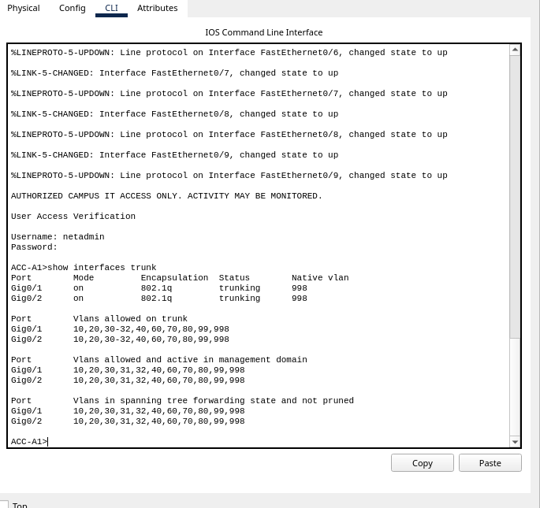

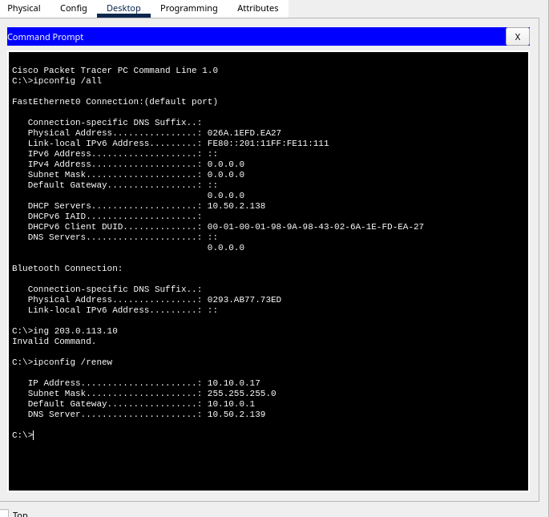

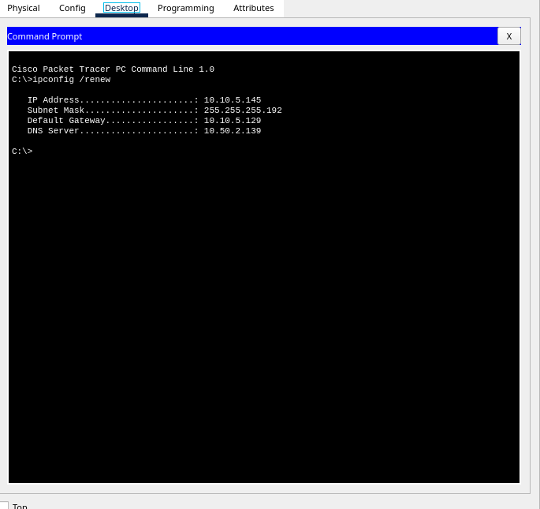

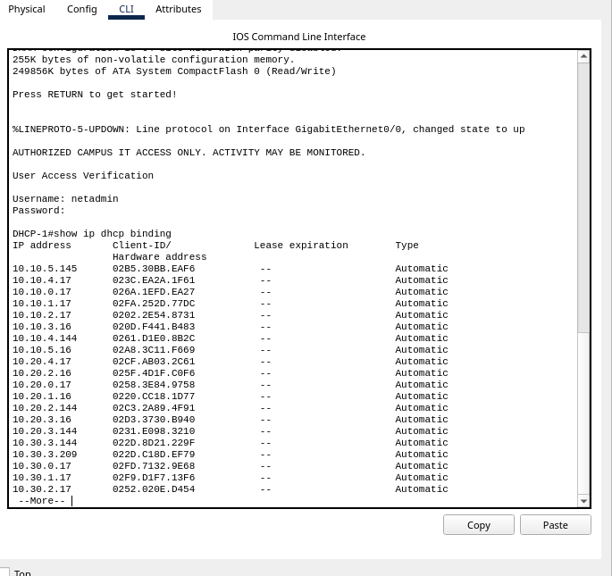

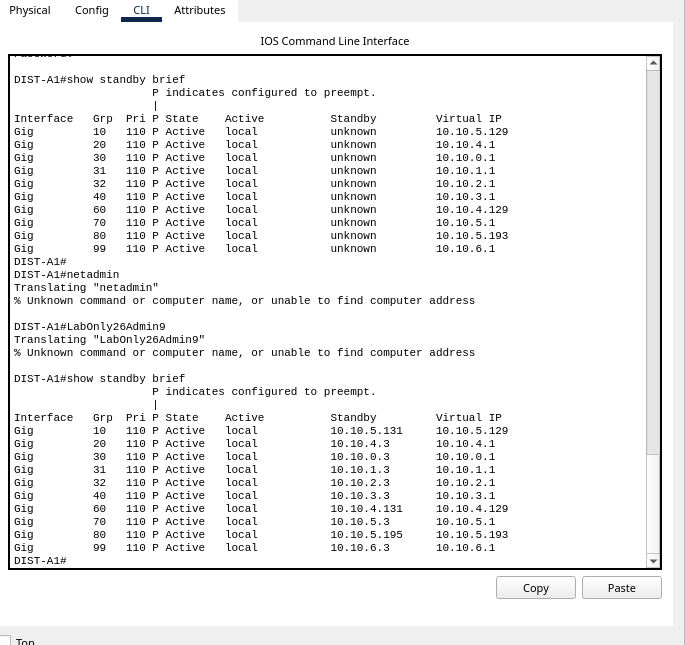

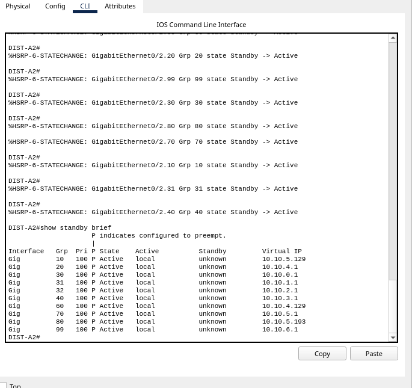

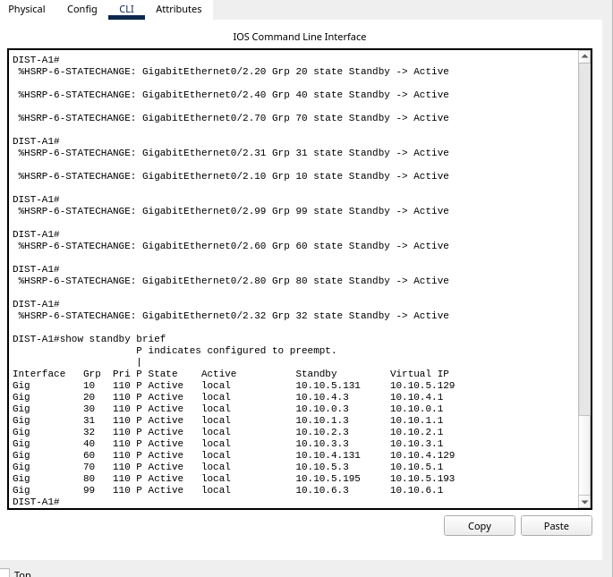

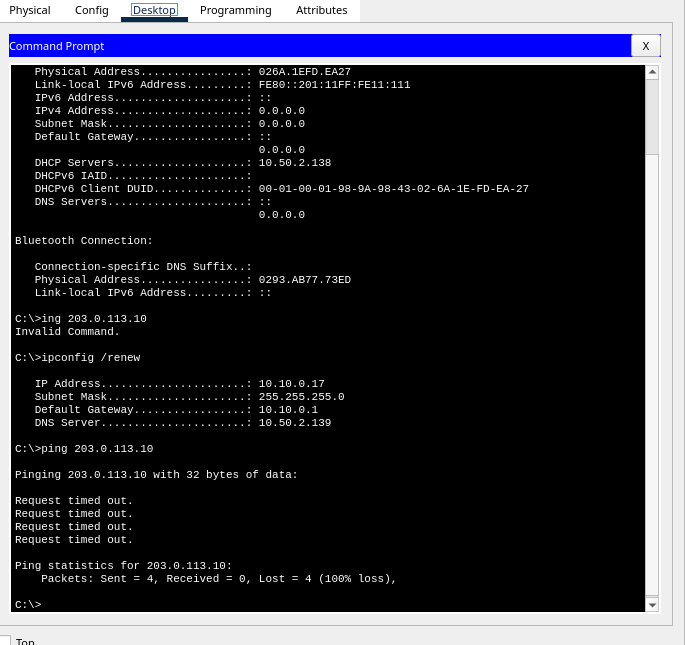

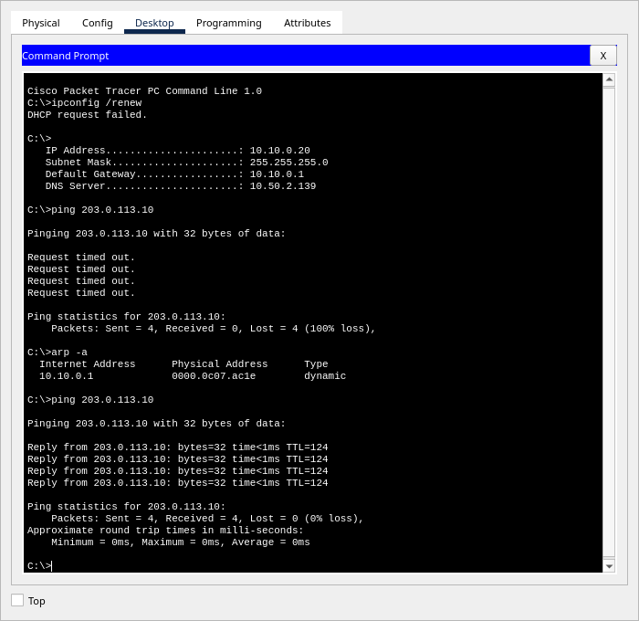
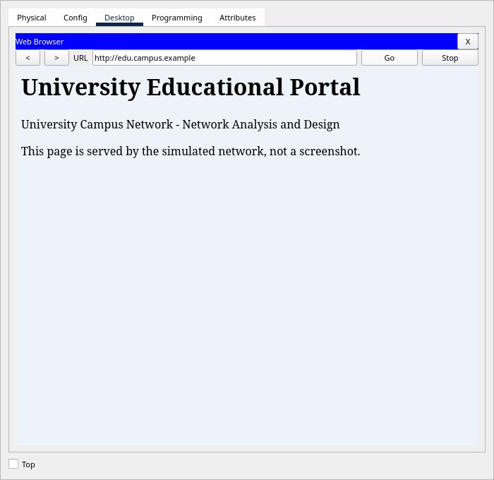
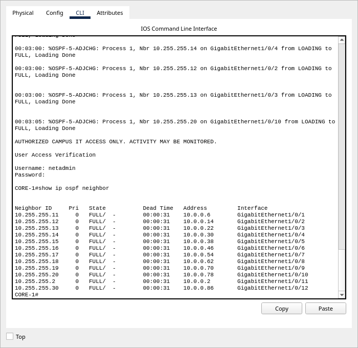
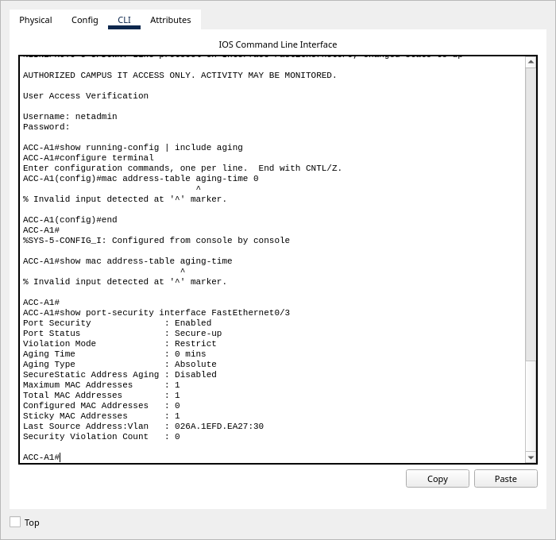
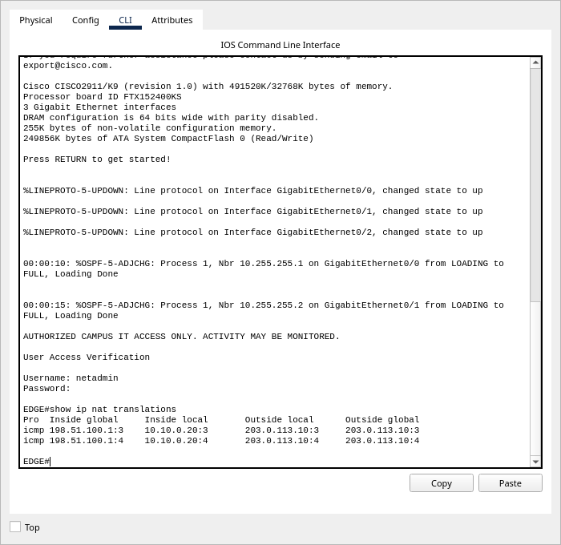